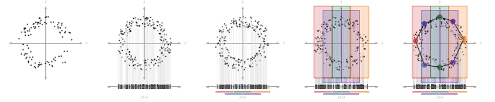

# Topological Data Analysis: Mapper Algorithm# Topological Data Analysis: Mapper Algorithm
[](https://doi.org/10.5281/zenodo.18288784) [](https://cran.r-project.org/package=MapperAlgo) <a href="https://CRAN.R-project.org/package=MapperAlgo" target="_blank" rel="noreferrer">  </a>

This R package implements the Mapper algorithm for topological data analysis (TDA). The Mapper algorithm facilitates visualisation and analysis of high-dimensional data by constructing a simplicial complex that represents the data's underlying structure. The package offers the standard Mapper [F-Mapper](https://www.sciencedirect.com/science/article/pii/S0950705119304794) and [G-Mapper](https://epubs.siam.org/doi/pdf/10.1137/24M1641312) algorithms, in addition to multiple clustering methods and visualisation tools.

## Get started quickly

 Step visualize from [Skaf et al.](https://doi.org/10.1016/j.jbi.2022.104082)

**Mapper is basically a three-step process:**

1\. **Cover**: This step splits the data into overlapping intervals and creates a cover for the data.

2\. **Cluster**: This step clusters the data points in each interval the cover creates.

3\. **Simplicial Complex**: This step combines the two steps above to connect the data points in the cover, creating a simplicial complex.

> You can learn more about the basics here: Chazal, F., & Michel, B. (2021). An introduction to topological data analysis: fundamental and practical aspects for data scientists. Frontiers in artificial intelligence, 4, 667963.

### Examples
More examples could be found in  `inst/example` with function applications. For a more detailed explanation of this package, this [document](https://019c9000-f3f9-6599-47b4-1cff4047c68f.share.connect.posit.cloud/) will be kept updated for better understanding of the source code.

``` r
data <- get(data("iris"))

Mapper <- MapperAlgo(
  data[,1:4],
  filter_values = data[,1:3],
  percent_overlap = 20,
  methods = "kmeans",
  method_params = list(max_kmeans_clusters = 2),
  cover_type = 'stride',
  interval_width = 1,
  num_cores = 12
  )
FMapper <- FuzzyMapperAlgo(
  original_data = data[,1:4],
  filter_values =  data[,1:2],
  cluster_n = 8,
  fcm_threshold = 0.2,
  methods = "kmeans",
  method_params = list(max_kmeans_clusters = 2)
)
GMapper <- GMapperAlgo(
  data[,1:4],
  filter_values = data[,1],
  AD_threshold = 0.8,
  g_overlap = 0.5,
  methods = "kmeans",
  method_params = list(max_kmeans_clusters = 2),
  num_cores = 12
)

MapperPlotter(Mapper, label=data$Species, original_data=data, avg=FALSE, use_embedding=FALSE)
MapperPlotter(FMapper, label=data$Species, original_data=data, avg=FALSE, use_embedding=FALSE)
MapperPlotter(GMapper, label=data$Species, original_data=data, avg=FALSE, use_embedding=FALSE)

```

|  |  |  |
| :---: | :---: | :---: |
| Mapper | F-Mapper | G-Mapper |

## Frontend

You can try the interactive frontend in [tda frontend](https://tda-rfrontend.vercel.app/). To visualise your own data, upload a JSON file formatted as shown below. The `cc` is optional; you can ignore it unless you have pre-calculated labels. Any feedback is welcome; please send it to kennywang2003@gmail.com or add an issue.

``` r
library(jsonlite)

export_data <- list(
  adjacency = Mapper$adjacency,
  num_vertices = Mapper$num_vertices,
  level_of_vertex = Mapper$level_of_vertex,
  points_in_vertex = Mapper$points_in_vertex,
  original_data = as.data.frame(all_features),
  # This is the label that is already calculated for each node (optional)
  cc = tibble(
    eigen_centrality = e_scores,
    betweenness = b_scores
  )
)
write(toJSON(export_data, auto_unbox = TRUE), "~/desktop/frontend.json")
```